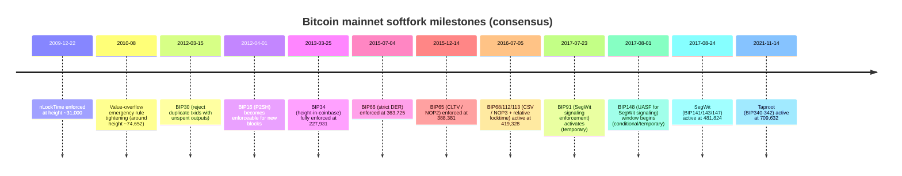
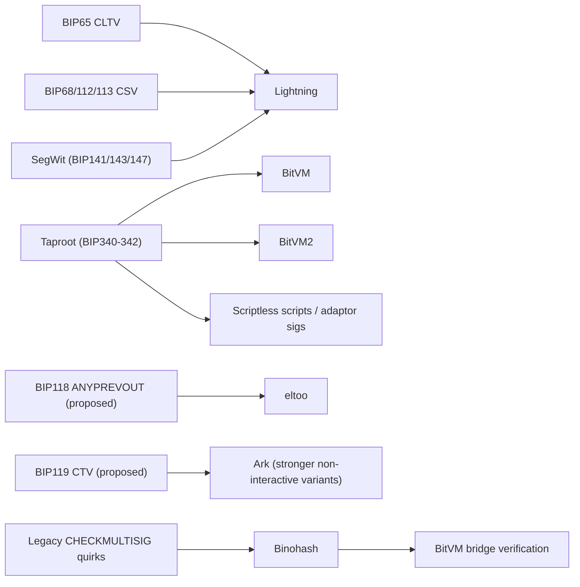

# Bitcoin Softforks and the Research Lineage of Bitcoin Programmability and Scaling

## Executive summary

Bitcoin’s consensus evolution through softforks has largely followed a pattern: (a) **tighten validation rules** to eliminate edge-case consensus divergence or malleability risks; (b) **repurpose previously reserved opcodes (NOPs)** to add carefully-scoped primitives (timelocks); and later (c) introduce **versioned, extensible “envelopes”** for future upgrades (SegWit witness programs; Taproot/Tapscript). citeturn16view0turn46search12turn47search3

On the scaling and programmability side, major breakthroughs map cleanly onto those consensus primitives. **Lightning** depends on script-enforced timelocks (CLTV + CSV) and—in practice—on **SegWit’s malleability fix** to make pre-signed, multi-transaction channel protocols robust. citeturn23view2turn46search12turn11search0 **eltoo** proposes a simpler channel update mechanism but requires a new sighash primitive (often discussed as SIGHASH_NOINPUT / ANYPREVOUT), which remains **unactivated** on Bitcoin mainnet. citeturn50view2turn48search18turn21view0

A more recent cluster of papers (BitVM → BitVM2 → BitVM3, plus work on Lamport/Winternitz signatures, garbled circuits, and transaction-introspection “hacks” like **Binohash**) targets “programmability without softforks” by turning Bitcoin Script into a **verification layer** for disputes, while pushing almost all compute off-chain. citeturn24view0turn24view1turn41view0turn43view0 Several of the newest garbled-circuit papers explicitly build on this direction (e.g., BABE/Argo MAC), though some primary PDFs are currently difficult to retrieve directly from IACR ePrint in this environment (HTTP 403), so metadata is grounded in author pages and reputable public announcements. citeturn30view0turn36search7turn31search3

## Method and definitions

This report treats a **Bitcoin softfork** as a **backward-compatible consensus rule tightening** that (i) activated on Bitcoin mainnet (dominant chain), and (ii) changed what blocks/transactions are valid for upgraded nodes. Pure relay/mempool policy changes are excluded. citeturn16view0turn3view0

“Activation date” is reported as:
- the **first time the new rules are enforced** (often a block height and the calendar date derived from that point), or
- for early-era changes, an **approximate incident-response window** when enforcement was deployed quickly and coordinated manually. citeturn16view0turn44view2

“Primary sources” are prioritized in this order: **BIPs (bips.dev / bitcoin/bips), Bitcoin Core release notes & consensus docs, original papers/PDFs, and original mailing list posts** (bitcoin-dev / bitcoindev archives). citeturn3view0turn47search1turn21view0turn22search4

## Chronological history of Bitcoin softforks

### Softfork timeline overview

The timeline below summarizes the mainnet softfork milestones used later to map research dependencies. citeturn16view0turn46search12turn11search0turn47search3



### Chronological softfork list with technical impact

| Activation (date) | Activation (height) | Softfork (BIP set) | Consensus rule changes (what became invalid) | Script / opcode impact | Primary sources |
|---|---:|---|---|---|---|
| 2009-12-22 | 31,000 | nLockTime consensus enforcement (pre-BIP) | Blocks containing non-final transactions (per nLockTime) become invalid after the activation threshold. | No new opcodes; enforces transaction finality semantics in consensus. | citeturn16view0turn44view0 |
| 2010-08 (incident-response window) | ~74,652 | Value overflow emergency fix (pre-BIP) | Tightened validity limits to prevent creation of out-of-range monetary values (coordinated rollback away from the “bad block” era). | No new opcodes; adds strict numeric bounds checks to consensus rules. | citeturn16view0turn44view2turn45view1 |
| 2012-03-15 | (time-based) | **BIP30** | Disallows transactions that would create a duplicate txid when an older txid still has unspent outputs (mitigating merkle/consensus hazards). | No script changes. | citeturn3view0turn16view0 |
| 2012-04-01 | 173,805 (commonly cited) | **BIP16 (P2SH)** | New P2SH validation rules apply only to blocks at/after a specified timestamp; scripts that were previously valid can become invalid after activation if they violate P2SH rules. | Introduces P2SH evaluation semantics (script-hash indirection); no new opcode, but changes how scripts are committed/validated. | citeturn51search13turn51search9turn16view0 |
| 2013-03-25 | 227,931 | **BIP34** | Requires coinbase scriptSig to start with the block height (and ultimately rejects older-version blocks once enforcement thresholds reached). | Indirect script impact (coinbase encoding convention); no new opcode. | citeturn46search0turn16view0turn3view0 |
| 2015-07-04 | 363,725 | **BIP66 (Strict DER signatures)** | Transactions with non–strict-DER-encoded ECDSA signatures become invalid. | Tightens ECDSA signature encoding requirements; affects signature parsing/validation in SCRIPT. | citeturn46search1turn46search12turn16view0 |
| 2015-12-14 | 388,381 | **BIP65 (CHECKLOCKTIMEVERIFY)** | Repurposes NOP2 to CHECKLOCKTIMEVERIFY; scripts using it now enforce absolute timelock conditions; invalidates spends that fail CLTV rules when used. | New opcode behavior: `OP_CHECKLOCKTIMEVERIFY` (formerly NOP2) enables enforceable absolute timelocks in script. | citeturn46search0turn46search12turn14view3 |
| 2016-07-05 | 419,328 | **BIP68 + BIP112 + BIP113 (CSV package)** | Adds consensus meaning to sequence locks and enforces relative locktime; applies CHECKSEQUENCEVERIFY; changes nLockTime evaluation to use median time past. | New opcode behavior: `OP_CHECKSEQUENCEVERIFY` (formerly NOP3) + enforceable relative timelocks; strengthens timelock semantics. | citeturn15view0turn14view0turn46search12 |
| 2017-07-23 | ~477k (see source) | **BIP91** (temporary coordination softfork) | During its active period, blocks not signaling the SegWit bit can be rejected by BIP91-enforcing nodes/miners—intended to guarantee SegWit lock-in compatibility with BIP148. | No opcode changes; changes block validity under a temporary signaling constraint. | citeturn46search10turn51search2turn16view0 |
| 2017-08-01 (start of window) | (time-based; MTP) | **BIP148** (UASF; conditional/temporary) | Enforces mandatory signaling for SegWit during a defined time window unless SegWit already locked in; non-signaling blocks become invalid to BIP148 nodes in that window. | No opcode changes; a time-bounded block acceptance constraint for activation politics/coordination. | citeturn51search3turn46search10turn16view0 |
| 2017-08-24 | 481,824 | **SegWit (BIP141 + BIP143 + BIP147)** | Introduces witness programs and new digest rules for segwit spends; fixes multiple transaction malleability vectors; enforces new rules for witness program validation. | Enables SegWit v0 script execution in the witness; changes sighash (BIP143); fixes CHECKMULTISIG dummy element malleability (BIP147). | citeturn11search0turn8search5turn10view0 |
| 2021-11-14 | 709,632 | **Taproot (BIP340 + BIP341 + BIP342)** | Introduces SegWit v1 spending rules; activates Schnorr signatures and Tapscript constraints; adds new script semantics and upgrade hooks. | Enables Schnorr (BIP340) and Tapscript (BIP342), including new opcode behavior (e.g., signature aggregation-friendly constructs); activates at a fixed minimum height. | citeturn47search3turn47search1turn47search2 |

## Breakthrough papers and projects for programmability and scaling

This section lists major research artifacts (papers/posts/code drops) that shaped Bitcoin scaling and programmability, with explicit mapping to the softfork primitives above. Items explicitly requested by the user are included and labeled as such.

### Chronological list of breakthrough papers/projects

| Date (first public release) | Breakthrough (title) | Authors | Short abstract | Key technical contributions | Enabled by / requires | Implementation status & notable implementations | Primary sources |
|---|---|---|---|---|---|---|---|
| 2008-10-31 | Bitcoin: A Peer-to-Peer Electronic Cash System | entity["people","Satoshi Nakamoto","bitcoin author"] | Proposes a decentralized electronic cash system using PoW, chaining blocks, and digital signatures to prevent double spends without a trusted intermediary. | Defines the baseline ledger model, transaction chaining, and consensus design that subsequent scaling layers build on. | Base protocol (not a softfork dependency). | Implemented as Bitcoin itself. | citeturn51search0 |
| 2014-10-22 | Enabling Blockchain Innovations with Pegged Sidechains | entity["people","Adam Back","blockstream cofounder"]; entity["people","Matt Corallo","bitcoin developer"]; entity["people","Luke Dashjr","bitcoin developer"]; entity["people","Mark Friedenbach","bitcoin developer"]; entity["people","Gregory Maxwell","bitcoin developer"]; entity["people","Andrew Miller","cryptography researcher"]; entity["people","Andrew Poelstra","cryptographer"]; entity["people","Jorge Timón","bitcoin developer"]; entity["people","Pieter Wuille","bitcoin developer"] | Proposes “pegged sidechains” enabling BTC (or other assets) to move between chains while isolating failures to the sidechain. | Formalizes the sidechain framing: pegged asset movement, experimentation off mainnet, and interoperability as a scaling/feature-development strategy. | Unspecified (design spans multiple peg models; depends on federation/merged-mining/drivechain-like assumptions). | Multiple sidechain approaches exist; the paper itself is foundational rather than a single implementation. | citeturn49view4turn50view3 |
| 2016-01-14 (user-requested) | The Bitcoin Lightning Network: Scalable Off-Chain Instant Payments | entity["people","Joseph Poon","lightning coauthor"]; entity["people","Thaddeus Dryja","lightning coauthor"] | Proposes routing payments across a network of bidirectional channels, using timelocks and hashlocks to enforce settlement on-chain only when needed. | Networked channels, HTLC-style routing, and the L2 “payment network” model; identifies transaction malleability as a critical obstacle and motivates malleability-resistant sighash designs. | Practically enabled by **CLTV (BIP65)** + **CSV package (BIP68/112/113)** and strongly enabled by **SegWit**’s malleability fixes (and modern sighash rules). | Widely implemented (BOLT specs and multiple node implementations); mainnet Lightning use accelerated after SegWit activation. | citeturn23view2turn46search12turn11search0 |
| 2017-03-04 | Scriptless Scripts (talk/paper lineage for adaptor signatures) | (author above) | Shows how digital signature algebra (especially Schnorr) can encode contract conditions without revealing complex scripts on-chain. | “Scriptless” contracts, foundational framing for adaptor signatures and DLC-style constructions; emphasizes reduced on-chain footprint/privacy improvements. | Best supported by **Taproot/Schnorr**, but some adaptor-signature variants exist for ECDSA as well. | Influenced later Bitcoin contract designs (DLCs, PTLCs, atomic swaps). | citeturn49view1turn50view0 |
| 2017 (paper; date not printed in accessible PDF) | Discreet Log Contracts (DLCs) | (author above) | Proposes oracle-driven contracts whose presence is not easily distinguished on-chain, minimizing oracle trust while improving scalability/privacy. | Oracle-signed outcomes + discrete-log tricks to make on-chain settlement indistinguishable from normal spends; contract privacy/scalability framing. | Most naturally enabled by Schnorr and adaptor signatures; can be approximated with pre-Taproot techniques at higher cost/complexity. | Multiple DLC implementations exist in the ecosystem; reference paper is foundational. | citeturn49view2turn48search9 |
| 2018-06-22 (mailing list) / 2018 (paper) | eltoo: A Simple Layer2 Protocol for Bitcoin | entity["people","Christian Decker","lightning researcher"]; entity["people","Rusty Russell","bitcoin developer"]; entity["people","Olaoluwa Osuntokun","lightning labs cofounder"] | Proposes a channel update mechanism where the latest state can always override earlier states, avoiding penalty/punishment mechanics. | “Replace-by-latest-state” channel model; introduces “floating transactions” concept; simplifies channel logic vs penalty-based LN. | Requires a new sighash primitive (“SIGHASH_NOINPUT” / ANYPREVOUT-family) per authors’ bitcoin-dev note; **unactivated** on Bitcoin mainnet. | Research/design stage; widely discussed; not deployed as specified due to missing consensus primitive. | citeturn50view2turn48search18 |
| 2023-10-09 (mailing list) / 2023-12-12 (paper date; user-requested item cluster) | BitVM: Compute Anything on Bitcoin | (author above) | Introduces a paradigm for “Turing-complete” *verification* on Bitcoin by using challenge-response fraud proofs and large Taproot trees, without consensus changes. | Optimistic verification model on Bitcoin; dispute game encoded with pre-signed transactions; frames Bitcoin as a verification layer rather than an execution VM. | Requires no new softfork per paper, but relies heavily on **Taproot** (large taproot trees, modern script) and the general SegWit witness model as deployed. | Multiple experimental implementations and follow-on proposals exist (e.g., BitVM repos and tooling). | citeturn22search4turn23view0turn24view0 |
| 2023-05-22 (user-requested) | Ark: An Alternative Privacy-preserving Second Layer Solution | entity["people","Burak Keceli","ark author"] | Proposes a joinpool-style L2 with “virtual UTXOs (vTXOs),” frequent operator rounds, and unilateral exits, aiming for low on-chain footprint and better receiver UX than classic channels. | vTXO accounting under shared UTXOs; periodic “round” transactions; interoperability story with Lightning; explicit discussion of covenant primitives for better non-interactive/offline receive. | Explicitly calls out need for covenant-like features such as **BIP-118 (ANYPREVOUT)** or **BIP-119 (CTV)** for stronger versions; those are **unactivated**, so enabling softfork is **unspecified / future**. | Active research and early implementations/prototypes exist externally; original post is a design publication. | citeturn21view0 |
| 2024-04-28 (user-requested) | Signing a Bitcoin Transaction with Lamport Signatures (no changes needed) | entity["people","Ethan Heilman","bitcoin researcher"] | Explores verifying Lamport-style commitments about a transaction by using Bitcoin Script to inspect signature lengths, avoiding OP_CAT. | Uses ECDSA signature-length variability + `OP_SIZE` to carry information and build Lamport-style verification on transaction data; positions it as preliminary/assumption-heavy. | Requires **no softfork**; uses existing Script operations and legacy signature behavior. | Research discussion thread; not a standardized deployed primitive. | citeturn43view0 |
| 2024-11-13 (user-requested topic) | Winternitz One-Time Signatures in Bitcoin Script (discussion/prototype track) | (community thread; author varies) | Explores implementing/verifying Winternitz one-time signatures in Script and discusses feasibility/size constraints. | Concrete exploration of post-quantum/hash-based signature verification within Script constraints (size/opcount/stack limits). | Typically benefits from modern script envelopes (SegWit/Tapscript) but many constructions are “today’s Bitcoin” experiments; enabling softfork often **unspecified** in discussions. | Prototype-level; used as a building block in BitVM-style constructions and PQ discussions. | citeturn42search18turn38view0 |
| 2024 (paper date not explicit on title page; cited as 2024 in later work) | BitVM2: Bridging Bitcoin to Second Layers | Robin Linus (and coauthors listed in paper) | Improves over BitVM by targeting fewer on-chain transactions and permissionless challenging; applies it to bridge design. | Permissionless challenging; reduces dispute transaction count; demonstrates bridging architecture based on optimistic verification of proof systems. | “No consensus changes” claim in abstract; practically uses Taproot-era script model and transaction structuring. | Multiple projects reference BitVM2-style bridges; formal ePrint version also exists. | citeturn23view1turn24view1turn38view0 |
| 2025 (formal preprint version) | Bridging Bitcoin to Second Layers via BitVM2 (formalization) | (Robin Linus et al.) | Formal preprint describing a BitVM2-based bridge design. | Formal security and protocol articulation of BitVM2-bridge style designs. | Same as BitVM2: no new consensus changes claimed; relies on Taproot-era scripting/witness environment. | Research/preprint; referenced by builders of Bitcoin L2 bridge systems. | citeturn22search1turn46search7 |
| 2026-02-25 (user-requested) | Binohash: Transaction Introspection Without Softforks | Robin Linus | Introduces a collision-resistant “digest” readable in Script by exploiting legacy CHECKMULTISIG FindAndDelete + proof-of-work signature grinding. | A “covenant-like” transaction introspection technique without softforks; explicit framing for BitVM bridges needing on-chain-to-off-chain binding without trusted oracles. | Requires **no softfork** but relies on **legacy script quirks** (notably behavior around `OP_CHECKMULTISIG`), and practical mining inclusion of non-standard-but-consensus-valid transactions. | Paper includes proof-of-concept discussion and claims of demonstrated transactions; overall technique is experimental and constraint-heavy. | citeturn40view0turn38view0turn41view0 |
| 2026-01 to 2026-02 (user-requested; primary PDF partially inaccessible here) | BABE: Verifying Proofs on Bitcoin Made 1000x Cheaper (garbled circuits) | (listed on author publication pages) | Proposes a protocol to drastically reduce setup/storage overhead for proof verification on Bitcoin, using witness-encryption/garbled-circuit style techniques (as publicly described). | Targets the “off-chain overhead” bottleneck in BitVM/garbled-verifier approaches; positions itself as a large constant-factor improvement in practicality. | Enabling softfork **unspecified** (positioned as “Bitcoin verification protocol” work; public descriptions tie it to BitVM-style patterns). | Research/preprint; announced publicly; primary IACR PDF link exists but may be inaccessible in some environments. | citeturn30view0turn36search7turn36search10 |
| 2026-01 (user-requested; primary PDF partially inaccessible here) | Argo MAC: Garbling with Elliptic Curve MACs (garbled circuits) | (listed in public metadata/announcements) | Introduces a garbling primitive aimed at making garbled-verifier constructions dramatically more efficient; referenced as a building block for BABE. | New garbling technique for ECC-oriented computation; used as a component in Bitcoin-proof-verification feasibility narratives. | Enabling softfork **unspecified**. | Research/preprint; referenced publicly; primary IACR link exists but may be inaccessible in some environments. | citeturn31search3turn25search0 |
| 2019 (user-requested: adaptor signatures) | One-Time Verifiably Encrypted Signatures (Adaptor Signatures) | (L. Fournier) | Formalizes adaptor-signature style constructions as a cryptographic primitive useful for scriptless contracts/atomicity. | Clean formal model for adaptor signatures; bridges “scriptless” contract ideas to cryptographic definitions and security properties. | No consensus change required; best ergonomics with Schnorr/Taproot for many Bitcoin use cases, but concept applies more broadly. | Widely used conceptually in DLCs and scriptless-contract designs; not a distinct consensus feature. | citeturn48search0turn49view1 |

## Relationship map between softfork primitives and major protocols

The graph below captures the most operational dependencies discussed in current Bitcoin engineering: timelocks → channel protocols; malleability fixes → stable pre-signed transaction graphs; modern script envelopes → BitVM-style verification systems; covenant-like proposals → next-gen L2 pool constructions such as Ark variants. citeturn46search12turn11search0turn47search3turn21view0turn24view0



## Programmatic JSON dataset

The JSON below mirrors the report in a machine-readable form. For concision and stability, dates are ISO-8601 where known; if only year/month is defensible from sources, the field is left as a partial date with an explanatory note. Items where the enabling softfork is not clearly specified are explicitly marked `"unspecified"`, per request.

```json
{
  "as_of_date": "2026-03-01",
  "softforks": [
    {
      "name": "nLockTime consensus enforcement (pre-BIP)",
      "bips": [],
      "activation": { "height": 31000, "date_utc": "2009-12-22" },
      "consensus_rule_changes": [
        "Reject blocks containing non-final transactions (nLockTime not satisfied) after enforcement threshold."
      ],
      "script_opcode_impact": [
        "No new opcodes; enforces transaction finality semantics in consensus."
      ],
      "primary_sources": [
        "https://bitcoinops.org/en/topics/soft-fork-activation/"
      ],
      "notes": "Early-era softfork; activation hardcoded by height."
    },
    {
      "name": "Value overflow emergency rule tightening (pre-BIP)",
      "bips": [],
      "activation": { "height": 74652, "date_utc": "2010-08", "date_note": "incident-response window; exact day varies by narrative" },
      "consensus_rule_changes": [
        "Tightened monetary-range validity checks to prevent overflow-style creation of invalid amounts; coordinated rollback away from the bad block era."
      ],
      "script_opcode_impact": [
        "No new opcodes; adds stricter numeric bounds checks."
      ],
      "primary_sources": [
        "https://bitcoinops.org/en/topics/soft-fork-activation/",
        "https://github.com/bitcoin/bitcoin/commit/2d12315c94f12d62b2f2aa39e63511a2042fe55d"
      ],
      "notes": "Emergency response included deliberate reorg to discard the overflowed transaction block."
    },
    {
      "name": "Reject duplicate txids with unspent outputs",
      "bips": [30],
      "activation": { "date_utc": "2012-03-15", "date_note": "hardcoded time activation" },
      "consensus_rule_changes": [
        "Mark invalid any tx that duplicates an earlier txid while the earlier tx still has unspent outputs."
      ],
      "script_opcode_impact": [],
      "primary_sources": [
        "https://raw.githubusercontent.com/bitcoin/bitcoin/master/doc/bips.md",
        "https://bitcoinops.org/en/topics/soft-fork-activation/"
      ]
    },
    {
      "name": "Pay to Script Hash (P2SH)",
      "bips": [16],
      "activation": { "height": 173805, "date_utc": "2012-04-01" },
      "consensus_rule_changes": [
        "New P2SH validation rules apply to blocks at/after the specified activation timestamp."
      ],
      "script_opcode_impact": [
        "Introduces script-hash indirection (P2SH) semantics; no new opcode."
      ],
      "primary_sources": [
        "https://bips.dev/16/",
        "https://bitcoinops.org/en/topics/soft-fork-activation/"
      ]
    },
    {
      "name": "Height-in-coinbase / v2 blocks",
      "bips": [34],
      "activation": { "height": 227931, "date_utc": "2013-03-25" },
      "consensus_rule_changes": [
        "Require block height to be committed in coinbase scriptSig; eventually reject older-version blocks after ISM thresholds."
      ],
      "script_opcode_impact": [
        "Coinbase scriptSig format constraint; no new opcode."
      ],
      "primary_sources": [
        "https://bips.dev/90/",
        "https://raw.githubusercontent.com/bitcoin/bitcoin/master/doc/bips.md"
      ]
    },
    {
      "name": "Strict DER signature encoding",
      "bips": [66],
      "activation": { "height": 363725, "date_utc": "2015-07-04" },
      "consensus_rule_changes": [
        "Reject non-strict-DER-encoded ECDSA signatures."
      ],
      "script_opcode_impact": [
        "Tightens signature encoding rules for script validation."
      ],
      "primary_sources": [
        "https://bips.dev/66/",
        "https://bitcoinops.org/en/topics/soft-fork-activation/",
        "https://bips.dev/90/"
      ]
    },
    {
      "name": "CHECKLOCKTIMEVERIFY (CLTV)",
      "bips": [65],
      "activation": { "height": 388381, "date_utc": "2015-12-14" },
      "consensus_rule_changes": [
        "Repurpose NOP2 into OP_CHECKLOCKTIMEVERIFY; enforce absolute timelock conditions when used."
      ],
      "script_opcode_impact": [
        "New opcode behavior: OP_CHECKLOCKTIMEVERIFY (formerly NOP2)."
      ],
      "primary_sources": [
        "https://bips.dev/65/",
        "https://bips.dev/90/",
        "https://gist.github.com/ajtowns/1c5e3b8bdead01124c04c45f01c817bc"
      ]
    },
    {
      "name": "CSV package (relative locktime + CHECKSEQUENCEVERIFY + MTP locktime)",
      "bips": [68, 112, 113],
      "activation": { "height": 419328, "date_utc": "2016-07-05" },
      "consensus_rule_changes": [
        "Enforce relative locktime rules (sequence locks) and CHECKSEQUENCEVERIFY; use median-time-past for some locktime checks."
      ],
      "script_opcode_impact": [
        "New opcode behavior: OP_CHECKSEQUENCEVERIFY (formerly NOP3)."
      ],
      "primary_sources": [
        "https://bips.dev/68/",
        "https://bips.dev/112/",
        "https://bips.dev/113/",
        "https://gist.github.com/ajtowns/1c5e3b8bdead01124c04c45f01c817bc"
      ]
    },
    {
      "name": "BIP91 (SegWit signaling enforcement; temporary)",
      "bips": [91],
      "activation": { "height": 477120, "date_utc": "2017-07-22", "date_note": "community reports vary by source; see primary discussion links" },
      "consensus_rule_changes": [
        "During active period, blocks not signaling SegWit bit are rejected by enforcing nodes/miners."
      ],
      "script_opcode_impact": [],
      "primary_sources": [
        "https://blog.bitmex.com/bitcoins-consensus-forks",
        "https://bitcointalk.org/index.php?topic=2042175.0"
      ]
    },
    {
      "name": "BIP148 (UASF for SegWit; conditional/temporary)",
      "bips": [148],
      "activation": { "date_utc": "2017-08-01", "date_note": "MTP-based start of enforcement window" },
      "consensus_rule_changes": [
        "Reject non-signaling blocks within specified time window unless SegWit already locked in/activated."
      ],
      "script_opcode_impact": [],
      "primary_sources": [
        "https://bips.dev/148/",
        "https://blog.bitmex.com/bitcoins-consensus-forks"
      ]
    },
    {
      "name": "Segregated Witness (SegWit) package",
      "bips": [141, 143, 147],
      "activation": { "height": 481824, "date_utc": "2017-08-24" },
      "consensus_rule_changes": [
        "Activate witness programs and new signature digest rules; fix several malleability vectors; enforce new segwit spending semantics."
      ],
      "script_opcode_impact": [
        "New script execution context for witness v0; new sighash algorithm for segwit spends."
      ],
      "primary_sources": [
        "https://blockstream.com/2017/08/24/en-segwit-activated/",
        "https://bitcoincore.org/en/segwit_wallet_dev/",
        "https://bips.dev/141/"
      ]
    },
    {
      "name": "Taproot / Schnorr / Tapscript package",
      "bips": [340, 341, 342],
      "activation": { "height": 709632, "date_utc": "2021-11-14" },
      "consensus_rule_changes": [
        "Activate segwit v1 spending rules; enable Schnorr signatures and Tapscript semantics."
      ],
      "script_opcode_impact": [
        "Schnorr signatures (BIP340) and Tapscript rules (BIP342), enabling new opcode semantics and upgrade hooks."
      ],
      "primary_sources": [
        "https://bips.dev/341/",
        "https://bitcoincore.org/en/2021/05/01/release-0.21.1/",
        "https://bitcoin.org/en/releases/0.21.1/"
      ]
    }
  ],
  "breakthroughs": [
    {
      "title": "Bitcoin: A Peer-to-Peer Electronic Cash System",
      "authors": ["Satoshi Nakamoto"],
      "first_public_release_date_utc": "2008-10-31",
      "abstract_short": "Defines a peer-to-peer electronic cash system using proof of work and chained blocks to prevent double spends without a trusted intermediary.",
      "key_contributions": ["PoW chain consensus", "UTXO-style transaction model framing", "baseline scripting/signature approach"],
      "enabled_by_softforks_or_features": ["unspecified (base protocol)"],
      "implementation_status": "Implemented as Bitcoin",
      "primary_sources": ["https://bitcoin.org/bitcoin.pdf"]
    },
    {
      "title": "Enabling Blockchain Innovations with Pegged Sidechains",
      "authors": ["Adam Back", "Matt Corallo", "Luke Dashjr", "Mark Friedenbach", "Gregory Maxwell", "Andrew Miller", "Andrew Poelstra", "Jorge Timón", "Pieter Wuille"],
      "first_public_release_date_utc": "2014-10-22",
      "abstract_short": "Proposes pegged sidechains allowing assets to move between chains while isolating failures to the sidechain.",
      "key_contributions": ["Sidechain framing for innovation and scaling", "Two-way peg design space articulation (federated/merged-mined/other)"],
      "enabled_by_softforks_or_features": ["unspecified (depends on peg model)"],
      "implementation_status": "Foundational design paper; multiple sidechain models exist",
      "primary_sources": ["https://blockstream.com/sidechains.pdf"]
    },
    {
      "title": "The Bitcoin Lightning Network: Scalable Off-Chain Instant Payments",
      "authors": ["Joseph Poon", "Thaddeus Dryja"],
      "first_public_release_date_utc": "2016-01-14",
      "abstract_short": "Proposes a routed network of payment channels using timelocks and hashlocks, settling on-chain only on disputes or netting out.",
      "key_contributions": ["HTLC-style routed payments", "networked L2 payments model", "malleability-aware channel design"],
      "enabled_by_softforks_or_features": ["BIP65 (CLTV)", "BIP68/112/113 (CSV)", "BIP141/143/147 (SegWit)"],
      "implementation_status": "Deployed ecosystem-wide (multiple implementations; BOLT specs)",
      "primary_sources": ["https://lightning.network/lightning-network-paper.pdf"]
    },
    {
      "title": "Scriptless Scripts (MIT Bitcoin Expo slides)",
      "authors": ["Andrew Poelstra"],
      "first_public_release_date_utc": "2017-03-04",
      "abstract_short": "Shows how signature algebra (especially Schnorr) can encode contract conditions without revealing complex scripts on-chain.",
      "key_contributions": ["Scriptless contract framing", "precursor to adaptor signatures and DLCs", "privacy/efficiency motivation"],
      "enabled_by_softforks_or_features": ["BIP340-342 (Taproot/Schnorr) strongly synergistic; some ECDSA variants exist"],
      "implementation_status": "Concept widely used in DLCs, atomic swaps, PTLC research",
      "primary_sources": ["https://download.wpsoftware.net/bitcoin/wizardry/mw-slides/2017-03-mit-bitcoin-expo/slides.pdf"]
    },
    {
      "title": "Discreet Log Contracts",
      "authors": ["Thaddeus Dryja"],
      "first_public_release_date_utc": "2017",
      "first_public_release_date_note": "MIT DCI describes paper as published in 2017; PDF copy accessible via MIT DCI hosting in this environment without explicit title-page date.",
      "abstract_short": "Oracle-driven contracts designed to be indistinguishable on-chain, improving privacy and minimizing oracle trust.",
      "key_contributions": ["Oracle-signed outcomes", "discreet settlement indistinguishable from normal spends", "scalable smart-contract framing"],
      "enabled_by_softforks_or_features": ["Taproot/Schnorr beneficial; not strictly required for all variants"],
      "implementation_status": "Multiple DLC implementations exist; paper is foundational",
      "primary_sources": ["https://www.dci.mit.edu/s/discreet-log-contracts-paper.pdf", "https://www.dci.mit.edu/projects/discreet-log-contracts"]
    },
    {
      "title": "eltoo: A Simple Layer2 Protocol for Bitcoin",
      "authors": ["Christian Decker", "Rusty Russell", "Olaoluwa Osuntokun"],
      "first_public_release_date_utc": "2018-06-22",
      "abstract_short": "Simplifies payment-channel updates by making only the latest state enforceable, avoiding penalty mechanisms.",
      "key_contributions": ["State-numbered replace-by-latest channel design", "floating transactions"],
      "enabled_by_softforks_or_features": ["Requires SIGHASH_NOINPUT / ANYPREVOUT-family proposal (unactivated)"],
      "implementation_status": "Not deployed as specified due to missing consensus primitive",
      "primary_sources": ["https://blockstream.com/eltoo.pdf", "https://gnusha.org/pi/bitcoindev/874ljsitvx.fsf@gmail.com/"]
    },
    {
      "title": "Ark: An Alternative Privacy-preserving Second Layer Solution",
      "authors": ["Burak Keceli"],
      "first_public_release_date_utc": "2023-05-22",
      "abstract_short": "Proposes an L2 with vTXOs and operator rounds to reduce on-chain footprint and ease receiving payments, with unilateral exit safety.",
      "key_contributions": ["vTXO joinpool model", "round-based batching", "explicit covenant-primitive discussion for stronger non-interactive variants"],
      "enabled_by_softforks_or_features": ["Proposed: BIP118 (ANYPREVOUT) or BIP119 (CTV); otherwise unspecified"],
      "implementation_status": "Active research/prototyping; original post is design publication",
      "primary_sources": ["https://gnusha.org/pi/bitcoindev/CAHUwRvvo-HE%3DdY00jErFMgAqq_jCS_hCna%3DeaAQPYLkGSEHYtA%40mail.gmail.com/t/"]
    },
    {
      "title": "BitVM: Compute Anything on Bitcoin",
      "authors": ["Robin Linus"],
      "first_public_release_date_utc": "2023-10-09",
      "paper_date_utc": "2023-12-12",
      "abstract_short": "Introduces optimistic verification (fraud proofs) using Taproot trees and pre-signed disputes, claiming no consensus changes are needed.",
      "key_contributions": ["Optimistic verification layer on Bitcoin", "dispute games encoded via transactions", "fraud-proof style reasoning for Bitcoin contracts"],
      "enabled_by_softforks_or_features": ["BIP340-342 (Taproot) practical prerequisite for large trees; claims no new softforks required"],
      "implementation_status": "Active experimentation; several repos exist",
      "primary_sources": ["https://gnusha.org/pi/bitcoindev/CCA561B6-A2DE-46FD-A2F8-98E0C34A3EEE%40zerosync.org/", "https://bitvm.org/bitvm.pdf"]
    },
    {
      "title": "BitVM2: Bridging Bitcoin to Second Layers",
      "authors": ["Robin Linus", "Lukas Aumayr", "Alexei Zamyatin", "Andrea Pelosi", "Zeta Avarikioti", "Matteo Maffei"],
      "first_public_release_date_utc": "2024",
      "date_note": "Title page in accessible PDF copy does not clearly show an exact date; later publications cite it as 2024.",
      "abstract_short": "Improves BitVM with permissionless challenging and fewer on-chain transactions; illustrates a bridge design.",
      "key_contributions": ["Permissionless challenging", "fewer dispute transactions", "bridge architecture based on optimistic verification"],
      "enabled_by_softforks_or_features": ["Taproot-era script/witness environment; no new consensus changes claimed"],
      "implementation_status": "Research; referenced by builders; formal ePrint version exists",
      "primary_sources": ["https://bitvm.org/bitvm_bridge.pdf", "https://eprint.iacr.org/2025/1158"]
    },
    {
      "title": "Signing a Bitcoin Transaction with Lamport Signatures (no changes needed)",
      "authors": ["Ethan Heilman"],
      "first_public_release_date_utc": "2024-04-28",
      "abstract_short": "Explores Lamport-style verification of transaction properties using ECDSA signature-length behavior and OP_SIZE.",
      "key_contributions": ["Signature-length as a Script-readable signal", "Lamport-style commitments without OP_CAT"],
      "enabled_by_softforks_or_features": ["No softfork required (uses existing Script)"],
      "implementation_status": "Mailing list research discussion; preliminary",
      "primary_sources": ["https://groups.google.com/g/bitcoindev/c/mR53go5gHIk"]
    },
    {
      "title": "Binohash: Transaction Introspection Without Softforks",
      "authors": ["Robin Linus"],
      "first_public_release_date_utc": "2026-02-25",
      "abstract_short": "Constructs a Script-readable transaction digest using legacy CHECKMULTISIG FindAndDelete behavior and signature-grinding PoW.",
      "key_contributions": ["Covenant-like introspection without consensus change", "bitvm-bridge-oriented onchain/offchain binding"],
      "enabled_by_softforks_or_features": ["No softfork required; relies on legacy script quirks and practical mining inclusion"],
      "implementation_status": "Experimental; includes proof-of-concept discussion and claimed demo transactions",
      "primary_sources": ["https://delvingbitcoin.org/t/binohash-transaction-introspection-without-softforks/2288", "https://robinlinus.com/binohash.pdf"]
    },
    {
      "title": "BABE: Verifying Proofs on Bitcoin Made 1000x Cheaper",
      "authors": ["Sanjam Garg", "Dimitris Kolonelos", "Mikhail Sergeevitch", "Srivatsan Sridhar", "David Tse"],
      "first_public_release_date_utc": "2026-01",
      "date_note": "Public announcements and publication pages place it in early 2026; the canonical IACR ePrint PDF link may be inaccessible in some environments.",
      "abstract_short": "Publicly described as a protocol to reduce setup/storage overhead for Groth16 proof verification on Bitcoin using witness-encryption/garbled-circuit techniques.",
      "key_contributions": ["Targets off-chain overhead bottlenecks in garbled-verifier approaches", "positions ~1000x reduction in setup/storage costs (per announcements)"],
      "enabled_by_softforks_or_features": ["Unspecified"],
      "implementation_status": "Research/preprint; announced publicly",
      "primary_sources": ["https://people.eecs.berkeley.edu/~sanjamg/publications/", "https://x.com/babylonlabs_io/status/2012303117657018790", "https://phemex.com/news/article/babylon-unveils-babe-protocol-to-slash-bitcoin-verification-costs-54238"]
    },
    {
      "title": "Argo MAC: Garbling with Elliptic Curve MACs",
      "authors": ["Liam Eagen", "Ying Tong Lai"],
      "first_public_release_date_utc": "2026-01",
      "date_note": "Metadata commonly reports last-updated 2026-01-19 on IACR ePrint search snippets; canonical PDF link may be inaccessible in some environments.",
      "abstract_short": "Introduces a garbling primitive intended to make ECC-oriented garbled computation (including garbled SNARK verifier components) substantially more efficient.",
      "key_contributions": ["New garbling primitive for ECC MAC-based computations", "explicitly referenced as a building block for BABE-style constructions"],
      "enabled_by_softforks_or_features": ["Unspecified"],
      "implementation_status": "Research/preprint",
      "primary_sources": ["https://eprint.iacr.org/2026/049", "https://eprint.iacr.org/search?q=elliptic+curve"]
    }
  ]
}
```